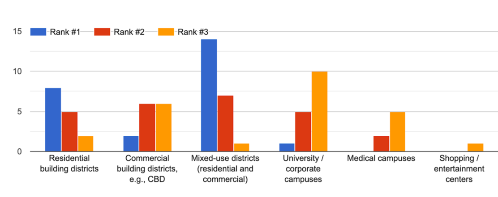
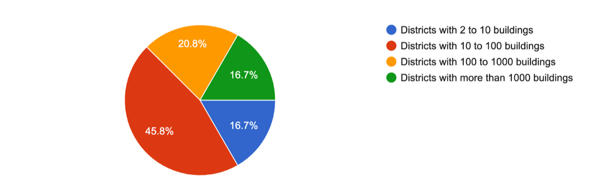
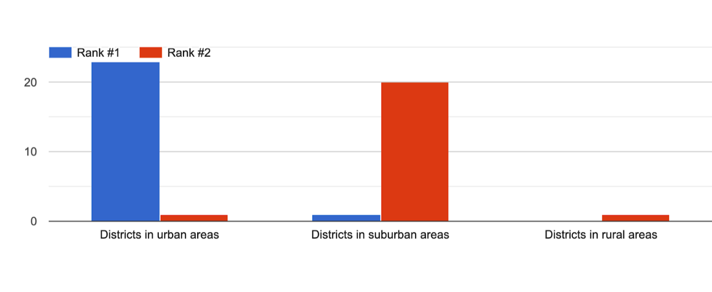
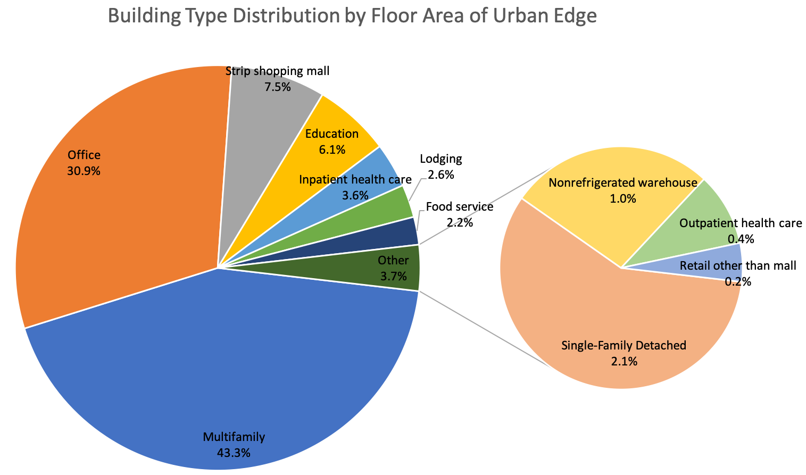
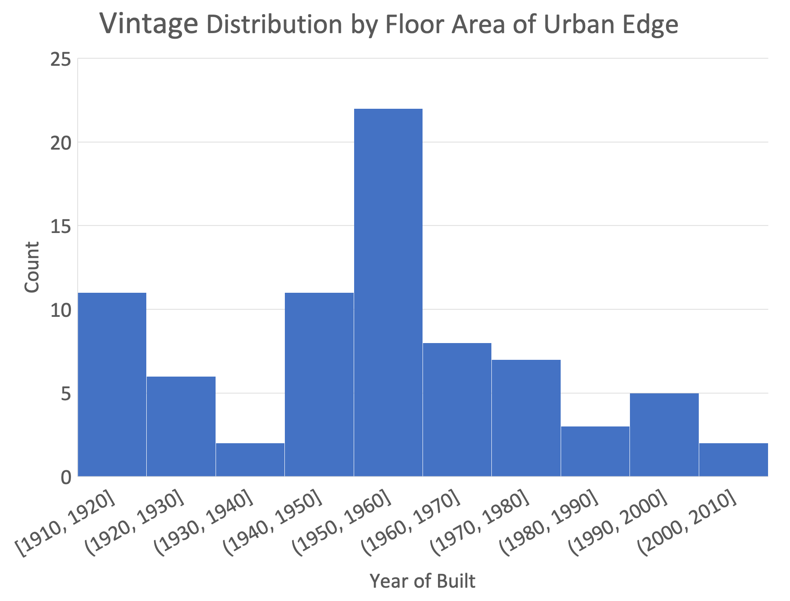

## Introduction
This is a collaboration between NREL and LBNL to develop of a suite of diverse, representative, and adaptable 
district prototype energy models covering various stakeholder use cases 
(e.g., central business district, residential district, highly PV-penetrated district, disadvantaged community), 
which enable modeling and evaluation of building technologies and control strategies for demand-side load reduction, 
management, and decarbonization at a district scale. The project will bridge the gap of no accessible and widely utilized 
prototype district models that can be adopted by the users for district scale analysis.
The developed prototype models will be integrated into URBANopt and can be directly used by the URBANopt workflow.

## Methodology
### Feedback Gathering
A survey was designed to gather technical feedback from relevant stakeholders to learn about their needs of district-scale use cases.
Based on the feedback, a list of high-demand district types were prioritized for development. 
The stakeholders reached out include researchers, consulting firms, AEC (architecture, engineering, and construction) companies, 
software developers, government agencies (federal/state/city), and community-based organizations. 
The questionnaire asked them about their experience in district-scale project, the scale, type and terrain of the districts they are mostly interested in.
Some of the key findings are illustrated in the figures below.  
- Mixed-use districts of commercial and residential are the most demanded in terms of use types, compared with other use types like residential-only, commercial-only, university/corporate campuses, and medical campuses.

- Districts with 10 to 100 buildings are predominantly demanded.

- Districts in urban areas are predominantly demanded.

### Prototype Definition
Scorecards that document the key modeling assumptions were first developed for four district types, Urban Core, Urban Edge, Suburban, and Rural districts that have 10-100 commercial and residential buildings.
Characteristics were gathered from 11 US cities with highest population density, including New York NY, Los Angeles CA, Chicago IL, Houston TX, Phoenix AZ, Philadelphia PA, Dallas TX, San Francisco CA, Seattle WA, Denver CO, Portland OR. 
For each city, 4 specific areas within the cities were selected using the Public Use Microdata Areas (PUMA) defined by the US Census Bureau. 
For the Urban Core the most dense PUMA was selected with the tallest buildings. Urban Edge was selected where density begins to drop off. The Suburban district was less dense and had more detached housing. Rural was even less dense but still in an area where there was some development. 
Building characteristics of each PUMA were collected from [ComStock](https://comstock.nrel.gov/) and [ResStock](https://resstock.nrel.gov/). 
The primary characteristics being gathered are a mix of building types, vintage, and number of stories all by building floor area, which were used as a reference to generate the example prototype model for future modeling with URBANopt.  
More district types and more cities with better representation of communities throughout the US may be included in future versions of the scorecard. 

## Template Model
[Template prototype models](https://github.com/urbanopt/urbanopt-prototype-district-templates) will be developed and released 
for each district type used as an input to create and run URBANopt, edit the district and perform various analyses that are available as standard scenarios and workflows in the URBANopt platform. 
The template model is a JSON file containing building footprints and building characteristics that represent a specific district type. 
Users can use these template models as a starting point to create the district models for their own needs, by modifying the location, geometry or characteristics of the buildings in the model.  
Currently, a template model for Urban Edge with 77 buildings has been developed. It's a mixed-use district of around 32 acres site area. Some of the details of the template prototype model are illustrated in the figures below.
<div class="row">
	<div class="col-7">
	    
	</div>
	<div class="col">
	    
	</div>
</div>

The template model is located in California (climate zone 3B), but can also be altered to run in the following ASHRAE Climate Zones found in the United States (1A Very Hot Humid, 2A Hot Humid, 2B Hot dry, 3A Warm Humid, 3B Warm Dry, 3C Warm Marine, 4A Mixed Humid, 4B Mixed Dry, 4C Mixed Marine, 5A Cool Humid, 5B Cool Dry, 5C Cool Marine, 6A Cold Humid, 6B Cold Dry, 7 Very Cold, 8 Subartic/Artic). 
Constructions used in the models will be customized for whatever climate zone the district is being analyzed in and the vintage/standards of the buildings.  


To use the template model, pull the `urbanopt-prototype-district-templates` repository from Github.
```
git clone 
```